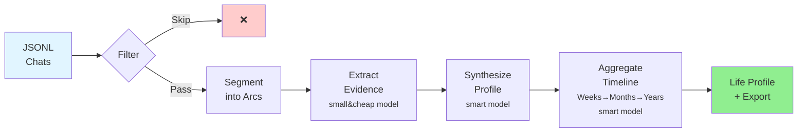
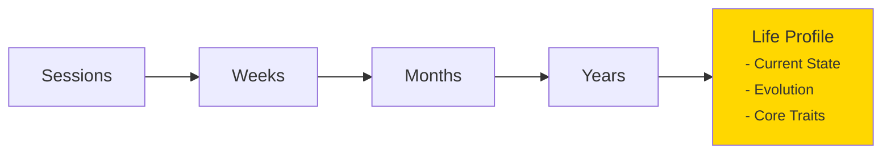

# ST-Mirror
ST-Mirror analyzes your SillyTavern chat logs to build psychological profiles from your roleplay choices.

Every RP decision reveals patterns: how you handle conflict, what you value, how you form attachments, whether you withdraw or pursue when vulnerable. This system treats those as behavioral evidence and aggregates them across hundreds of sessions into longitudinal profiles using Big Five personality, attachment theory, Schwartz values, and Jungian archetypes.

You get scored profiles (0-1) with confidence levels, evidence quotes from your messages, and timeline views showing stable traits vs. growth trajectories.

## How it works
**Three-stage pipeline:** Arc detection → Evidence extraction → Temporal aggregation

### Processing Flow


### 1. Arc Detection
Long RPs transition between narrative modes. The system detects arc boundaries using OOC/IC ratios, thematic content patterns, personal disclosure markers, and emotional intensity shifts. Each narrative arc is processed separately for better context handling.

### 2. Evidence → Profile (Two-Phase)
**Phase 1** uses cheap models (Gemini Flash Lite) to extract observable evidence from your messages: decisions, emotional moments, behavioral patterns, relationship dynamics, key quotes. Cumulative context prevents redundant re-analysis across chunks.

**Phase 2** uses smart models (Kimi K2) to synthesize complete psychological profiles:

-   **Big Five OCEAN** with 10 aspects (Openness: Intellect + Experience; Conscientiousness: Industriousness + Orderliness; Extraversion: Enthusiasm + Assertiveness; Agreeableness: Compassion + Politeness; Neuroticism: Volatility + Withdrawal)
-   **Attachment Theory** (anxiety/avoidance dimensions + primary style)
-   **Schwartz Values** (10 universal values)
-   **Jungian Archetypes** + defense mechanisms

Every score links to evidence quotes. Confidence calibrates to decision count (more data = higher confidence).

### 3. Temporal Aggregation


Aggregation solves a key problem: **you're not the same person you were a year ago**. A simple average would wash out growth. Instead:

-   **Decision weighting** prevents a 20-message test chat from diluting a 500-message deep session. More behavioral evidence = more influence on your profile.
-   **Recency weighting** for "current state": recent periods count 2× more than old ones. You get who you are NOW, not an average across your entire history.
-   **Evolution tracking** compares early vs. late periods to identify what changed. Stable traits (variance <0.15) reveal core identity. Trajectories show growth/decline patterns.

**Result**: Your life profile shows current self (recency-weighted), growth journey (evolution), and unchanging core (stable traits). All grounded in evidence quotes, no prescription or pathologizing.

## How to run

### 1. Install
**Using uv (recommended):**
```bash
# Install uv (if needed)
curl -LsSf https://astral.sh/uv/install.sh | sh

# Make an virtual environment and activate it
uv venv && source .venv/bin/activate

# Install the required packages
uv pip install -r requirements.txt
```

**Using pip:**
```bash
python -m venv .venv && source .venv/bin/activate
pip install -r requirements.txt
```

### 2. Configure
Get an [OpenRouter API key](https://openrouter.ai/) and set it:

```bash
export OPENROUTER_API_KEY=your_key_here
```

Edit `config.yaml` to set your name and pronouns (used in companion export):

```yaml
user:
    name: "Alex" # Your preferred name
    pronouns: "he/him" # Options: "he/him", "she/her", "they/them"
```

You can also tune other parameters in `config.yaml` as needed (model selection, processing settings, timeouts, etc.).
**Note**: By default, chats with fewer than 100 messages are filtered out. You can adjust this in `config.yaml` under `processing.classifier.min_messages`.

### 3. Prepare Data
Copy your SillyTavern `chats` folder to `ST_DATA/chats/` (preserving the character folder structure):

```bash
# Copy your entire chats folder from SillyTavern
cp -r /path/to/SillyTavern/data/your-user/chats ST_DATA

# Expected structure:
# ST_DATA/chats/Character Name/*.jsonl
# ST_DATA/chats/Another Character/*.jsonl

# Or use the sample data for testing:
cp -r ST_DATA_SAMPLE ST_DATA
```

**Note**: `ST_DATA_SAMPLE/` contains sample chats for testing the pipeline. Sample data was fully generated by Claude Code, designed to showcare psychological change over time.

### 4. Run
```bash
# Process all branches
uv run profile.py --chats-dir ST_DATA/chats

# Aggregate into timeline
uv run aggregate.py \
  ST_DATA/workspace/profiles \
  ST_DATA/workspace/aggregations
```

Your profiles will be in:

-   `ST_DATA/workspace/profiles/` - Individual session profiles
-   `ST_DATA/workspace/aggregations/life/life_profile.json` - Your complete profile
-   `ST_DATA/workspace/aggregations/life/companion_export.json` - AI companion export

## TODO
-   [ ] Fix getting costs from OpenRouter API (currently not tracking properly)
-   [ ] Support group chats (multiple participants in one conversation)
-   [ ] Support multiple user character cards better (for multiple people using the same ST deployment mb?)
-   [ ] Add progress visualization for long-running aggregations