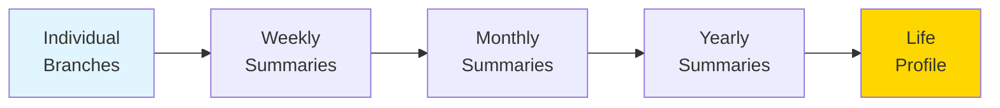
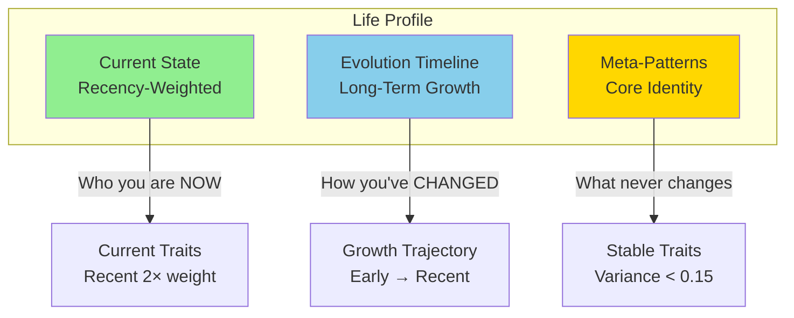

# ST-Mirror Prompts
System prompts and JSON schemas for ST-Mirror's psychological profiling pipeline.

## Overview
This directory contains the **prompt engineering** that powers ST-Mirror's four-stage profiling pipeline:

1. **Phase 1: Evidence Extraction** - Extract observable behavioral patterns from chat transcripts
2. **Phase 2: Profile Synthesis** - Synthesize individual session psychological profiles
3. **Aggregation: Period Synthesis** - Aggregate profiles across time periods (weeks→months→years)
4. **Life Synthesis** - Create final life-level profile with growth tracking and companion export

Each stage uses a specialized prompt paired with a strict JSON schema to ensure structured, parseable output.

## Pipeline Flow


## Design Philosophy

ST-Mirror's prompts prioritize psychological accuracy through **aspect-level granularity** (10 Big Five aspects vs 5 traits—same Conscientiousness score could mean productive chaos or organized procrastination), **evidence-based weighting** (500-message/15-decision roleplay >> 50-message/2-decision test chat), and **temporal sophistication** (current state via recency weighting, evolution via early/late comparison, core identity via stable traits <0.15 variance). All synthesis prompts require **thinking-first output** where models commit to evidence interpretation before assigning scores, preventing stereotype pattern-matching. The framework is **non-pathologizing** (honest about difficult patterns but contextualizing within growth, not diagnosis) and **roleplay-aware** (distinguishing cross-context signals from character-specific noise), with **companion export integration** distilling profiles into actionable AI guidance.

Key design choices emerged from empirical testing: **field ordering** enforced (models front-load easy fields when given freedom), **thinking-first required** (prevents stereotype pattern-matching and middle-range hedging), **aspect-level tracking** (Extraversion 0.65 could mean warm follower or cold leader—trait scores conflate radically different personalities), **recency weighting** (simple averages misrepresent both current state and growth—6mo at 0.65 + 6mo at 0.30 ≠ 0.475), and **decision weighting** (more decisions = more psychological evidence = more weight in aggregation).

## Prompt Files

| Prompt | Used By | Model | Purpose |
|--------|---------|-------|---------|
| **evidence_extractor.txt** | `phase1_extract_evidence()` | Gemini Flash Lite | Extract observable behavioral evidence from chat chunks |
| **profile_synthesizer.txt** | `phase2_synthesize_profile()` | Kimi K2 | Synthesize complete psychological profile from aggregated evidence |
| **period_synthesizer.txt** | `aggregate_period()` | Kimi K2 | Aggregate profiles across time periods (weeks/months/years) |
| **life_synthesizer.txt** | `build_hierarchy()` | Kimi K2 | Create comprehensive life profile with growth narrative and companion export |

### evidence_extractor.txt (Phase 1)
**Design Principle:** Maximize evidence extraction while minimizing cost

Analyzes USER messages only (is_user: true), distinguishes IC (in-character) from OOC (out-of-character) content, extracts structured evidence with cumulative context preventing redundant re-analysis across chunks. Field ordering enforced for output quality.

**Output Fields:**
- `decisions` (user choices with alternatives, max 5)
- `emotional_moments` (emotions with intensity/triggers, max 5)
- `behavioral_patterns` (repeated response patterns, max 3)
- `relationship_dynamics` (power balance, intimacy level, conflict/boundaries)
- `key_quotes` (psychologically revealing quotes, max 5)
- `context_flags` (boolean flags for vulnerability, conflict, intimacy, etc.)
- `if_then_observations` (conditional behavioral rules, max 3)


### profile_synthesizer.txt (Phase 2)
**Design Principle:** Aspect-level granularity reveals nuance (e.g., high Industriousness + low Orderliness = productive chaos)

Synthesizes complete psychological profiles from aggregated evidence across 9 dimensions: Big Five OCEAN (10 aspects), Attachment Theory, Schwartz Values, Jungian Archetypes, Defense Mechanisms, Behavioral Patterns, Emotional Profile, Relationship Patterns, Blind Spots. Begins with "thinking" field to show reasoning process before structured output.

<details>
<summary><b>Click to expand: Detailed Psychological Frameworks</b></summary>

#### Big Five OCEAN (Aspect-Level Analysis)
The Big Five personality model with **10 aspects** (2 per trait) provides nuanced personality profiling:

- **Openness** (intellectual curiosity and aesthetic sensitivity)
  - *Intellect*: Abstract thinking, pattern recognition, intellectual engagement
  - *Openness to Experience*: Aesthetic sensitivity, emotional depth, novelty-seeking

- **Conscientiousness** (goal-directed behavior and organization)
  - *Industriousness*: Work ethic, achievement drive, persistence
  - *Orderliness*: Organization, planning, preference for structure

- **Extraversion** (social energy and assertive engagement)
  - *Enthusiasm*: Warmth, sociability, positive emotion expression
  - *Assertiveness*: Leadership, dominance, taking charge

- **Agreeableness** (interpersonal harmony and cooperation)
  - *Compassion*: Empathy, care for others, emotional warmth
  - *Politeness*: Respect for authority, conflict avoidance, deference

- **Neuroticism** (emotional volatility and stress response)
  - *Volatility*: Emotional reactivity, mood swings, irritability
  - *Withdrawal*: Anxiety, rumination, fear response

**Why aspects matter**: Same trait score can mean very different things. Someone with high Extraversion could be a warm, enthusiastic follower (high Enthusiasm, low Assertiveness) or a cold, dominant leader (low Enthusiasm, high Assertiveness). Aspects reveal the *how* of personality.

#### Attachment Theory
Attachment patterns shape relationship dynamics and emotional regulation:

- **Four attachment styles**: Secure, Anxious-Preoccupied, Dismissive-Avoidant, Fearful-Avoidant
- **Anxiety dimension (0.0-1.0)**: Fear of abandonment, need for reassurance, relationship preoccupation
- **Avoidance dimension (0.0-1.0)**: Discomfort with intimacy, independence emphasis, emotional distance

Attachment scores derived from: proximity-seeking behaviors, response to separation, comfort with vulnerability, trust patterns, validation needs

#### Schwartz Values (Universal Motivations)
Ten fundamental values organized in a circumpolar structure:

- **Self-Direction**: Independent thought, autonomy, creativity
- **Stimulation**: Novelty, excitement, challenge
- **Hedonism**: Pleasure, sensory gratification, enjoyment
- **Achievement**: Success, competence, recognition
- **Power**: Status, control, dominance over resources
- **Security**: Safety, stability, harmony
- **Conformity**: Rule-following, appropriateness, restraint
- **Tradition**: Respect for customs, commitment to heritage
- **Benevolence**: Concern for close others, helpfulness, loyalty
- **Universalism**: Social justice, equality, environmental concern

Values are *motivations*, not behaviors. Someone might value Benevolence highly but show low Compassion due to avoidant attachment.

#### Jungian Archetypes (Narrative Patterns)
Archetypal patterns reveal how users structure meaning and identity (select top 3-5):

- **Self**: Integration, wholeness, authentic core
- **Shadow**: Rejected aspects, suppressed desires, unconscious drives
- **Anima/Animus**: Contrasexual inner figure, emotional depth
- **Persona**: Social mask, public presentation
- **Hero**: Courage, achievement, overcoming obstacles
- **Sage**: Wisdom-seeking, truth, understanding
- **Trickster**: Disruption, play, boundary-testing
- **Caregiver**: Nurturing, protection, service
- **Innocent**: Optimism, trust, simplicity
- **Explorer**: Discovery, freedom, authenticity
- **Rebel**: Revolution, liberation, disruption
- **Lover**: Intimacy, passion, connection

Archetypes emerge from repeated narrative patterns in RP choices, not explicit identification.

#### Additional Dimensions

- **Defense Mechanisms**: Psychological strategies for managing anxiety and threat (e.g., intellectualization, humor, sublimation, projection)
- **Behavioral Patterns**: Observable tendencies in decision-making, conflict response, goal pursuit
- **Emotional Profile**: Emotional range, regulation strategies, trigger sensitivity, baseline affect
- **Relationship Patterns**: Communication style, conflict approach, boundary-setting, intimacy comfort
- **Blind Spots**: Patterns visible to others but not to self, areas of low self-awareness

</details>


### period_synthesizer.txt (Aggregation)
**Design Principle:** Aspects can evolve independently - tracking them separately reveals psychological complexity

Aggregates profiles across hierarchical time periods (branches → weeks → months → years → life) using decision-weighted averaging for current state and early-vs-late comparison for evolution. Each of 10 aspects tracked separately, revealing trajectories that can move in opposite directions (e.g., Conscientiousness stable, but Industriousness ↑ while Orderliness ↓). Produces 200-300 word clinical narratives covering dominant themes, struggles, breakthroughs, and period context.

<details>
<summary><b>Click to expand: Hierarchical Structure & Methodology</b></summary>

**Hierarchical Levels:**



**Key Methodology:**

- **Current State (Period Average):** Decision-weighted averaging (more decisions = more weight, formula: `weight_i = decisions_i / sum(all_decisions)`, prevents short sessions from diluting deep sessions), aspect-level synthesis (each of 10 aspects tracked separately), confidence calibrates to total evidence
- **Evolution Tracking (Early vs Late):** Compares first half vs second half of period, identifies trajectories (increasing/decreasing/stable/fluctuating), aspect evolution tracked separately (can move opposite directions - example: Conscientiousness stable, but Industriousness ↑ while Orderliness ↓), detects turning points and significant shifts
- **Period Summary:** 200-300 word clinical narrative covering dominant themes, struggles, breakthroughs, and how period fits larger journey

</details>


### life_synthesizer.txt (Final Synthesis)
**Design Principle:** Current state + Growth trajectory + Core identity = Complete psychological portrait

Creates comprehensive life profile with three-part synthesis: (1) Current State - recency-weighted with recent periods counting 2× more, (2) Evolution Timeline - earliest→recent trajectories with turning points, (3) Meta-Patterns - stable traits with variance <0.15 revealing core identity. Includes companion export distilling full profile into actionable AI guidance (personality summary, interaction preferences, trigger management, growth context, relationship wisdom).

<details>
<summary><b>Click to expand: Three-Part Synthesis Details</b></summary>



1. **Current State (Recency-Weighted):** WHO the person IS NOW - recent periods count 2× more than old periods, combined recency × evidence weighting (oldest 1/3: 0.5× multiplier, middle 1/3: 1.0× multiplier, recent 1/3: 2.0× multiplier, plus decision-count weighting), aspect-level current scores for all 10 aspects
2. **Evolution Timeline (Long-Term Growth):** HOW the person has CHANGED - compare earliest → most recent, trajectory types (sustained_improvement, sustained_decline, stable, U-shaped, inverted_U), aspect evolution (each aspect's growth journey), turning points and major phases, attachment security progression, value system maturation
3. **Meta-Patterns (Core Identity):** WHAT never changes - stable traits (variance <0.15 across timeline), stable aspects (individual aspects that define core identity, example: Openness variable but Intellect consistently 0.8), universal if-then rules (present in 80%+ of periods), core values and persistent archetypes

**Companion Export:** Personality summary for AI integration, interaction preferences (communication style, pacing, validation needs), trigger management (activating triggers, soothing strategies, early warnings), growth context (healing journey, current phase, celebrate), relationship wisdom (attachment notes, conflict style, intimacy comfort)

</details>

## Schema Files

### evidence_schema.json
Validates Phase 1 evidence extraction output. Enforces strict field ordering, maximum item counts, and enum values for behavioral evidence extracted from chat chunks.

<details>
<summary><b>Click to expand: Full Schema Structure</b></summary>

**Properties:**
- `chunk_id`, `chunk_summary`, `word_count`, `ic_ooc_ratio`
- `decisions` (array, max 5 items)
- `emotional_moments` (array, max 5 items)
- `behavioral_patterns` (array, max 3 items)
- `relationship_dynamics` (object)
- `key_quotes` (array, max 5 items)
- `context_flags` (object with booleans)
- `if_then_observations` (array, max 3 items)

**Strict validation:** All fields required, enum values enforced, character limits enforced

</details>


### profile_schema.json
Validates Phase 2 individual session profiles. Structures complete psychological profiles with aspect-level Big Five scores, attachment dimensions, values, archetypes, and evidence links for all assessments.

<details>
<summary><b>Click to expand: Full Schema Structure</b></summary>

```json
{
  "thinking": "reasoning process...",
  "profile_id": "string",
  "data_summary": {
    "total_decisions": int,
    "total_emotional_moments": int,
    "ic_ooc_ratio": float
  },
  "big_five": {
    "openness": {
      "score": 0.0-1.0,
      "confidence": "low|medium|high",
      "aspects": {
        "intellect": {"score": 0.0-1.0, "confidence": "...", "evidence": []},
        "openness_to_experience": {"score": 0.0-1.0, "confidence": "...", "evidence": []}
      }
    },
    // ... 4 more traits (conscientiousness, extraversion, agreeableness, neuroticism)
  },
  "attachment": {...},
  "schwartz_values": {...},
  "archetypes": {...},
  "defense_mechanisms": {...},
  "behavioral_patterns": {...},
  "emotional_profile": {...},
  "relationship_patterns": {...}
}
```

**All 5 Big Five traits** include 2 aspects each (10 total aspects)

</details>


### period_schema.json
Validates period aggregation outputs (weeks/months/years). Tracks decision-weighted current state and early-vs-late evolution for each aspect, with aspect-level trajectory tracking revealing independent growth patterns within traits.

<details>
<summary><b>Click to expand: Full Schema Structure</b></summary>

```json
{
  "thinking": "reasoning process...",
  "period": "2025-W31 | 2025-08 | 2025",
  "level": "week|month|year",
  "meta": {
    "total_decisions": int,
    "branches_count": int,
    "date_range": {"start": "...", "end": "..."}
  },
  "current_state": {
    "big5": {...},  // Decision-weighted averages with aspects
    "attachment": {...},
    "schwartz_values": {...},
    "archetypes": {...},
    "behavioral_patterns": {...}
  },
  "evolution": {
    "big5": {
      "openness": {
        "trajectory": "increasing|decreasing|stable|fluctuating",
        "earliest_average": float,
        "recent_average": float,
        "change": float,
        "aspect_evolution": {
          "intellect": {"trajectory": "...", "change": "description"},
          "openness_to_experience": {"trajectory": "...", "change": "description"}
        }
      },
      // ... 4 more traits
    },
    "attachment": {...},
    "values": {...}
  },
  "period_summary": "200-300 word clinical narrative"
}
```

**Key Feature:** `aspect_evolution` tracks each aspect's trajectory separately within each trait

</details>


### life_schema.json
Validates final life profile output. Combines recency-weighted current state, earliest→recent evolution trajectories with turning points, stable trait identification (variance <0.15), and companion export for AI integration.

<details>
<summary><b>Click to expand: Full Schema Structure</b></summary>

```json
{
  "thinking": "comprehensive reasoning...",
  "meta": {
    "total_decisions": int,
    "total_branches": int,
    "date_range": {...},
    "hierarchy": "description of aggregation levels"
  },
  "current_state": {
    "big5": {...},  // Recency-weighted with all 10 aspects
    "attachment": {...},
    "schwartz_values": {...},
    "archetypes": {...},
    "behavioral_patterns": {...}
  },
  "evolution": {
    "big5": {
      "openness": {
        "trajectory": "sustained_improvement|sustained_decline|stable|U-shaped|inverted_U",
        "earliest_average": float,
        "recent_average": float,
        "change": float,
        "change_type": "growth|healing_progress|decline|shift",
        "turning_points": [{
          "period": "2025-08",
          "event": "description",
          "before": float,
          "after": float
        }],
        "narrative": "description of how this trait evolved",
        "aspect_evolution": {
          "intellect": {
            "trajectory": "...",
            "change": "earliest→recent - interpretation"
          },
          "openness_to_experience": {
            "trajectory": "...",
            "change": "earliest→recent - interpretation"
          }
        }
      },
      // ... 4 more traits
    },
    "attachment": {...},
    "values": {...},
    "timeline_summary": "3-5 major phases in growth journey"
  },
  "meta_patterns": {
    "stable_traits": {
      "big5": [...],  // Traits with <0.15 variance
      "stable_aspects": [...],  // Individual aspects with <0.15 variance
      "core_values": [...],
      "persistent_archetypes": [...]
    },
    "universal_patterns": [...],  // If-then rules in 80%+ periods
    "core_identity": "narrative"
  },
  "companion_export": {
    "personality_summary": "concise overview for AI companions",
    "current_traits": {...},
    "interaction_preferences": {...},
    "trigger_management": {...},
    "growth_context": {...},
    "relationship_wisdom": {...}
  }
}
```

</details>

## See Also
- `../toolkit/README.md` - Pipeline implementation details
- `../README.md` - Full ST-Mirror documentation
- `../ST_DATA_SAMPLE/README.md` - Sample analysis demonstrating these prompts in action
